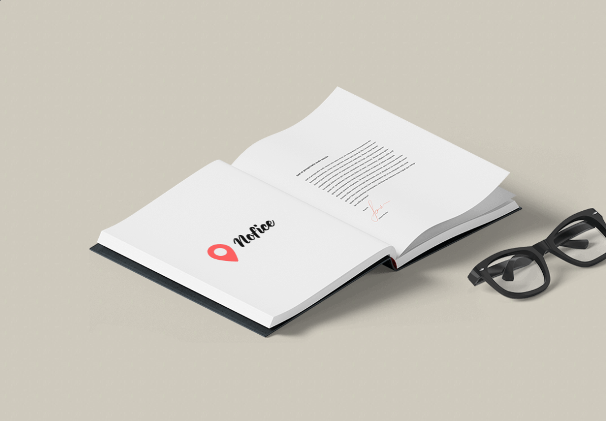
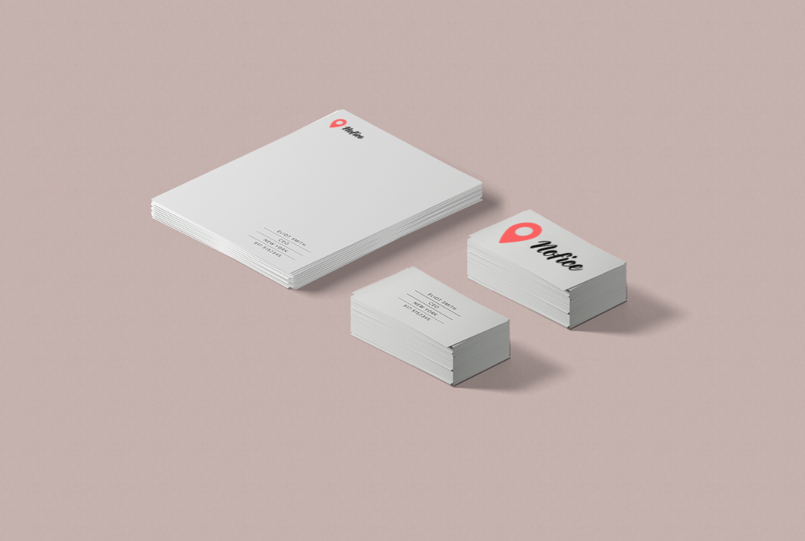
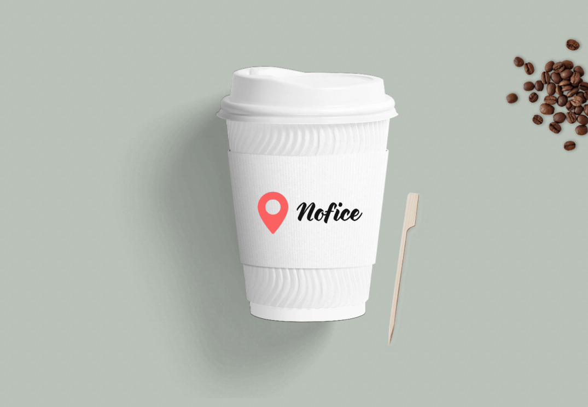

<div style='text-align: center;' align='center'>
    
</div>

# Nofice
> The official Nofice branding documentation.

## Content of property
### Slogan
> Nofice - _Innovation and technology does not require an office_

### About
> Nofice is a company that provide solutions through technology,  
> offering top notch consultancy without spending a dime on an office.  
> [Read More](ABOUT.md)

### Main Product
> The vital and primary product of Nofice is the consultancy platform,  
> where consultants can publish them self, and third-party entities such as
> companies and individuals can rent them.  
> All contracts are being implemented through this platform.  
> [Read More](MAIN_PRODUCT.md)

### Domain
> The following domains are used:
* [www.nofice.com](www.nofice.com)
* [nofice.com](nofice.com)
* [www.nofice.se](nofice.se)

## Graphics
### Logo
> The logo can befound here [graphics/logo.png](graphics/logo.png).  
> And here are some use cases of the logo:

| | | |
|:-------------------------:|:-------------------------:|:-------------------------:|
|book|cards|coffee|
|shirt||| 

### Colors
> The colors being used are the following:
```sass
$bright_green: #28a528
$darker_green: #129b12
$darkest_green: #097c09
$bright_brown: #bf6101
$darker_brown: #9a4d01
```
